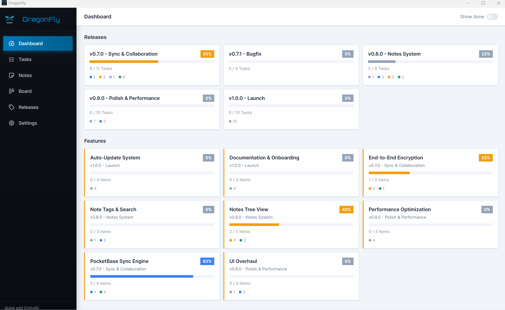
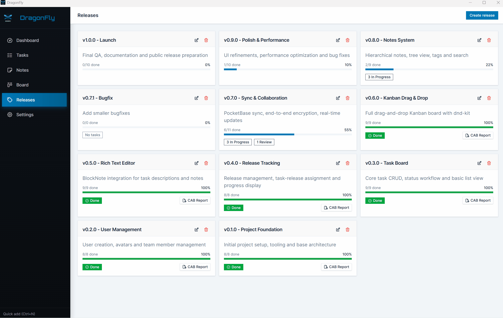
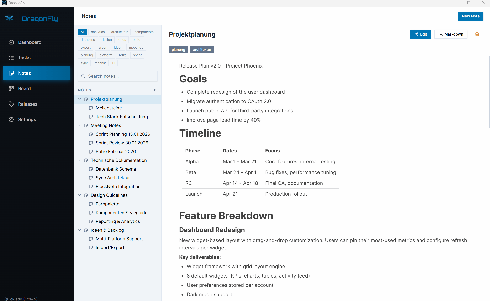

<div align="center">


# DragonFly

**Lightweight project management for small teams.**\
Projects &middot; Todos &middot; Releases &middot; Notes &mdash; all in one native desktop app.

[](https://github.com/McHill007/dragonfly-release/releases/latest)
[](https://github.com/McHill007/dragonfly-release/releases/latest)
[](https://github.com/McHill007/dragonfly-release/releases/latest)

---

### Download

> **[Latest Release](https://github.com/McHill007/dragonfly-release/releases/latest)**

| Installer | Description |
|-----------|-------------|
| `DragonFly.exe` | Portable Windows executable (no install needed) |
| `DragonFly_x.x.x_x64_en-US.msi` | Standard Windows Installer (MSI) |
| `DragonFly_x.x.x_x64-setup.exe` | NSIS Installer with **auto-update** support |
| `dragonfly_x.x.x_amd64.deb` | Debian / Ubuntu package |
| `dragonfly-x.x.x-1.x86_64.rpm` | Fedora / openSUSE package |
| `dragonfly_x.x.x_amd64.AppImage` | Portable Linux executable |

</div>

---

## Features

### Dashboard

Track your releases and features at a glance. See progress bars, task counts, and overall project health in one view.

<div align="center">

</div>

<br/>

### Kanban Board

Drag & drop tasks across columns. Features group their child tasks together &mdash; moving a feature moves all its tasks along.

<div align="center">

</div>

<br/>

### Tasks

Manage tasks and features with quick-add buttons, search, tags, and release assignment. Filter by release, feature, assignee, or tag.

<div align="center">

</div>

<br/>

### Releases

Plan and organize your releases. Assign tasks, track progress, and generate CAB reports.

<div align="center">

</div>

<br/>

### Notes

Block-based rich text editor with hierarchical sub-notes, Table of Contents navigation, full-text search, tags, and file attachments.

<div align="center">

</div>

<br/>

### Settings

Multi-language support (7 languages), customizable AI prompts, database backup, update check, user management, and optional sync configuration.

<div align="center">

</div>

---

## Multi-Project Support

Create and manage multiple projects from a visual project selection screen. Each project has its own tasks, notes, releases, and sync configuration. Join shared projects from teammates via `dragonfly://` Space URL or Sync URL + Space Key, or keep projects local-only.

---

## Your Server, Your Data

DragonFly works **fully offline** by default. All data stays on your machine.

For team sync, you self-host a [PocketBase](https://pocketbase.io) instance &mdash; your server, your rules. All synced data is **AES-GCM encrypted** with your space key before leaving the client. The server only stores opaque ciphertext.

### Quick Start

The `docker/` folder in this repository contains a ready-to-use `Dockerfile` and `docker-compose.yml`.

**1. Clone and start:**

```bash
git clone https://github.com/McHill007/dragonfly-release.git
cd dragonfly-release/docker
docker compose up -d --build
```

**2. Create a Superuser:**

```bash
docker exec dragonfly-pb /pb/pocketbase superuser create admin@example.com YOUR_PASSWORD
```

Or open the Admin UI at `http://localhost:8080/_/`.

**3. Connect DragonFly:**

In the app, go to **Settings > Sync** and enter:

| Field | Value |
|-------|-------|
| **Server URL** | `http://<your-server-ip>:8080` |
| **Admin Email** | The superuser email from step 2 |
| **Admin Password** | The superuser password from step 2 |
| **Space Key** | A shared passphrase (used for encryption + auth) |

Click **Setup Server** &mdash; DragonFly will automatically create all required collections and a sync user. After setup, click **Connect** to start syncing.

Teammates can **join** a synced project by entering the same Sync URL and Space Key in the Join Project dialog.

---

## Built with Modern Tools

| Layer | Technology |
|-------|------------|
| Runtime | [Tauri v2](https://v2.tauri.app) (Rust + WebView) |
| Frontend | React 19 + TypeScript + Vite |
| UI | Tailwind CSS v4 + shadcn/ui |
| Editor | BlockNote |
| State | Zustand |
| Sync | PocketBase (self-hosted) |

---

## Platform Notes

DragonFly is primarily developed and tested on **Windows**. Linux builds are provided as a convenience.

| Format | Tested on | Status |
|--------|-----------|--------|
| `.exe` / `.msi` | Windows 10/11 | Fully supported |
| `.deb` | Ubuntu 22.04+ | Works |
| `.rpm` | Fedora 36+ | Works |
| `.AppImage` | Ubuntu 22.04+ | Works |

> **Note:** RHEL-based distributions (Oracle Linux, CentOS, Rocky Linux) may lack the required `libwebkit2gtk-4.1` library. Use the AppImage on those systems or try Fedora instead.

If you run into problems on your Linux distribution, please [open an issue](https://github.com/McHill007/dragonfly-release/issues).

---

## Changelog

<<<<<<< HEAD
### v0.1.12

**Features**
- Personal reminders with due dates, recurrence, SMTP email notifications, and alert sound
- Minimize to system tray on window close (configurable in Settings)
- Autostart on system login — app starts in the tray so reminders are always active (cross-platform, configurable in Settings)
- Cross-device reminder sync via PocketBase: a single sync secret derives both a public record ID and a private AES encryption key — the server never sees the plaintext
- "New Task" entry in the tray context menu for quick task creation without opening the app
- Global **Ctrl+N** shortcut to open the new task dialog, even when the app is only in the tray

**Improvements**
- Admin credentials are now stored per project instead of globally, enabling multiple projects on different PocketBase servers
- Setting admin credentials for one project automatically propagates to all other local projects on the same server (trailing-slash normalized)
- Admin credential fields in the schema upgrade dialog are pre-filled when credentials are already stored for that project

**Bugfixes**
- Fix window X button doing nothing when "Minimize to Tray" is disabled
=======
### v0.1.11

**Improvements**
- Upgrade all dependencies (React 19, Zustand 5, Vite 7, dnd-kit 10, i18next 25, Tailwind 4.2, TypeScript 5.9)
- Resizable sidebar in Notes and Scratchpad pages (drag handle to widen)
- Batch move for kanban feature drag (single state update + single DB query instead of per-child)
- Fix download link on schema-blocked screen

**Bugfixes**
- Fix scratchpad content overwrite when switching quickly between pads
- Fix external links not opening (missing shell permission)

---

### v0.1.10

**Features**
- Scratchpad recycle bin in Settings > Data (restore, permanent delete, empty all)
- Scratchpad favorites with star toggle and collapsible sidebar section
- Multi-login auth handling: dialog to fix Space Key or leave project on auth failure
- Empty states for Releases, Todos, and Scratchpads with icons and create buttons

**Improvements**
- Notes favorites section collapsible with chevron toggle and count
- Scratchpads sorted alphabetically, showing created/updated timestamps
- Responsive task toolbar: collapse buttons and hide labels on smaller screens
- Sync tombstone fix: restored items no longer re-deleted on next sync
- Scratchpad autosave: flush pending changes on switch and navigation
>>>>>>> d6640cd1056bdc8cd2f539802907ee70174ffd08

---

### v0.1.9

**Improvements**
- Centralized logging service for consistent error tracking
- Fix silent catch blocks across the codebase
- Safe JSON.parse with fallback handling

---

### v0.1.8

**Features**
- Task priority field
- Note favorites with sticky links in sidebar
- Embeddable scratchpad blocks in notes and tasks
- Dashboard empty state with project selection improvements

**Improvements**
- New logo and sidebar font
- Center settings tabs and fix minimum width for settings cards
- Remove Hindi language
- Remove legacy JSON migration
- Robust schema verification and scratchpad improvements

**Bugfixes**
- Fix border in BlockNote editor

---

### v0.1.7

**Features**
- Scratchpad with Excalidraw drawing canvas (two-panel layout, auto-save, manual save)

---

### v0.1.6

**Features**
- `dragonfly://` Space URL protocol for simplified project joining
- Schema versioning system with automatic migration support
- Remote schema version check on project open and join
- PocketBase backup & restore help section in sync settings
- Logs tab in settings for sync diagnostics

**Improvements**
- Redesigned sync settings: separate sync info and admin credentials cards
- Verify admin credentials against server before saving
- Password visibility toggle for admin password fields
- Migrated admin credentials from config.ini to database
- Renamed release artifacts for consistency

---

### v0.1.5

**Features**
- Multi-project support with project selection screen and sidebar indicator
- Table of Contents panel for notes (heading extraction, click-to-scroll)
- Customizable AI prompts in Settings (Notes, Tasks, CAB report)
- Project leave functionality
- Collapsible tags section at bottom of notes tree sidebar

**Improvements**
- Better error handling in sync service
- Clean up attachments on project delete
- Fix tombstone reconnect loop (clear sync credentials on tombstone detection)

---

### v0.1.4

**Features**
- Collapsible sidebar (240px / 56px) with icon tooltips and smooth transition
- Collapsible Kanban columns with rotated text strip and drag-drop support
- Default collapsed columns configurable in Settings (persisted to database)
- Horizontal scroll on the board with min-width per column
- Settings reorganized into 5-tab system (General, Users, Data, Sync, About)
- License and third-party license info in About tab

**Improvements**
- Compact TaskCard design: smaller tags, release as text, avatar next to title
- Standardized font sizes across Dashboard, Tasks, and Releases pages
- Responsive toolbars with horizontal scroll and smaller controls
- Board usable at smaller window sizes (min-width reduced to 800px)

---

### v0.1.3

**Features**
- Update check in Settings (checks GitHub releases for new versions)
- Quick-add buttons on release headers and feature rows in Tasks view
- Search field to filter tasks by title
- CAB report generation for releases

**Improvements**
- TaskModal accepts initial release/feature values for pre-filled creation
- Linux CI builds fixed (icons included in repo)

---

### v0.1.1

**Features**
- Database backup (ZIP with DB + attachments) in Settings
- Recycle bin for tasks and notes with restore/permanent delete
- Delete confirmation dialogs for tasks, notes and releases
- Deleting a feature asks whether to also delete child tasks
- Tasks grouped under their feature in the board
- Dragging a feature moves all child tasks along
- Show/hide done toggle on the board
- Feature modal shows list of child tasks
- Dashboard with release and feature progress overview
- CSV export for tasks
- 6 new languages: Polish, French, Spanish, Italian, Romanian, Hindi
- Linux builds (DEB, RPM, AppImage)
- Portable Windows EXE in releases

**Improvements**
- Releases sorted descending in filter dropdowns
- Features sorted alphabetically in filter dropdown

**Bugfixes**
- Fixed build error caused by unsupported Array method

---

### v0.1.0

**Features**
- PocketBase sync with end-to-end encryption
- Passphrase protection with auto-lock
- Hierarchical notes with sub-notes
- AI text improvement (OpenAI integration)
- File attachments for tasks and notes
- Kanban board with drag-and-drop
- Features and tasks (two-level hierarchy)
- Release management with task assignment
- User management with color avatars
- Tags for tasks
- Automated build and release via GitHub Actions
