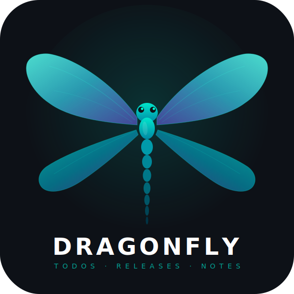

<div align="center">



# DragonFly

**Lightweight project management for small teams.**\
Todos &middot; Releases &middot; Notes &mdash; all in one native desktop app.

[](https://github.com/McHill007/dragonfly-release/releases/latest)
[](https://github.com/McHill007/dragonfly-release/releases/latest)
[](https://v2.tauri.app)

---

### Download

> **[Latest Release](https://github.com/McHill007/dragonfly-release/releases/latest)**

| Installer | Description |
|-----------|-------------|
| `DragonFly_x.x.x_x64_en-US.msi` | Standard Windows Installer (MSI) |
| `DragonFly_x.x.x_x64-setup.exe` | NSIS Installer with **auto-update** support |

</div>

---

## Features

- **Kanban Board** &mdash; Drag & drop tasks across customizable columns
- **Release Tracking** &mdash; Organize work into releases and track progress
- **Rich Notes** &mdash; Block-based editor with full formatting support
- **Team Collaboration** &mdash; Sync data across machines via PocketBase
- **End-to-End Encryption** &mdash; All synced data is encrypted with your space key
- **Offline-First** &mdash; Works fully offline, syncs when connected
- **Auto-Updates** &mdash; Stay current with built-in update mechanism (EXE installer)

---

## Sync Server (PocketBase)

DragonFly uses [PocketBase](https://pocketbase.io) as an optional sync backend. You can self-host it in seconds with Docker.

### Dockerfile

PocketBase has no official Docker image. Use this minimal `Dockerfile`:

```dockerfile
FROM alpine:latest

ARG PB_VERSION=0.36.3

RUN apk add --no-cache \
    unzip \
    ca-certificates

# Download and unzip PocketBase
ADD https://github.com/pocketbase/pocketbase/releases/download/v${PB_VERSION}/pocketbase_${PB_VERSION}_linux_amd64.zip /tmp/pb.zip
RUN unzip /tmp/pb.zip -d /pb/

EXPOSE 8080

CMD ["/pb/pocketbase", "serve", "--http=0.0.0.0:8080"]
```

### Docker Compose

Create a `docker-compose.yml` next to the `Dockerfile`:

```yaml
services:
  pocketbase:
    build: .
    container_name: dragonfly-pb
    restart: unless-stopped
    ports:
      - "8080:8080"
    volumes:
      - pb_data:/pb/pb_data

volumes:
  pb_data:
```

### Quick Start

**1. Build and start:**

```bash
docker compose up -d --build
```

**2. Create a Superuser:**

You can create the admin account directly via the CLI inside the container:

```bash
docker exec dragonfly-pb /pb/pocketbase superuser create admin@example.com YOUR_PASSWORD
```

Or open the Admin UI in your browser at `http://localhost:8080/_/` and create one there.

> **Important:** Save your admin credentials! You need them to set up the sync connection in DragonFly.

**3. Connect DragonFly:**

In the DragonFly app, go to **Settings > Sync** and enter:

| Field | Value |
|-------|-------|
| **Server URL** | `http://<your-server-ip>:8080` |
| **Admin Email** | The superuser email from step 2 |
| **Admin Password** | The superuser password from step 2 |
| **Space Key** | A shared passphrase (used for encryption + auth) |

Click **Setup Server** &mdash; DragonFly will automatically create all required collections and a sync user. After setup, click **Connect** to start syncing.

### PocketBase Collections

DragonFly automatically creates and manages these collections:

| Collection | Purpose |
|------------|---------|
| `df_tasks` | Encrypted task data |
| `df_releases` | Encrypted release data |
| `df_users` | Encrypted team member data |
| `df_notes` | Encrypted note data |
| `df_attachments` | File attachments (images, documents) |

All data fields are **AES-GCM encrypted** with your space key before leaving the client. The server only stores opaque ciphertext.

---

## Tech Stack

| Layer | Technology |
|-------|------------|
| Runtime | [Tauri v2](https://v2.tauri.app) (Rust + WebView) |
| Frontend | React 18 + TypeScript + Vite |
| UI | Tailwind CSS v4 + shadcn/ui |
| Editor | BlockNote |
| State | Zustand |
| Sync | PocketBase (self-hosted) |

---

<div align="center">

Made with precision in Austria.

</div>
